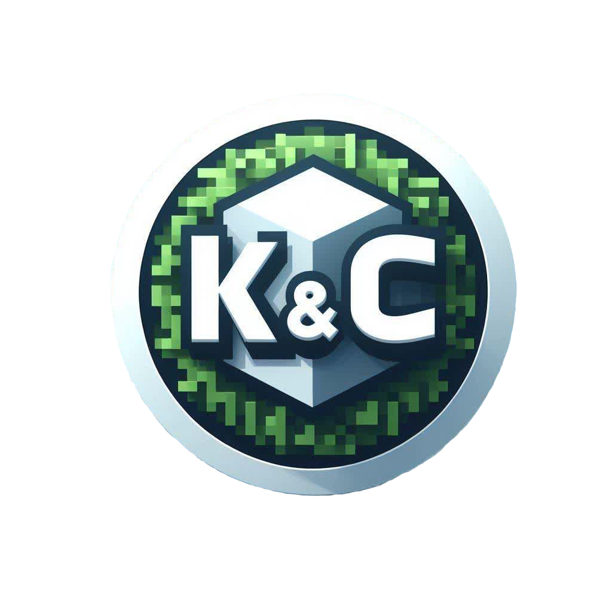

<h1 align="center">I&A Launcher</h1>

<em><h5 align="center">(Hosted By DJ SORROW)</h5></em>

Присоединяйтесь к модифицированным серверам, не беспокоясь об установке Java, Forge или других модов. Мы позаботимся об этом за вас.

! [Скриншот 1]()
! [Скриншот 2]()

## Функции

* 🔒 Полное управление Аккаунтом.
  * Добавляйте несколько учетных записей и легко переключайтесь между ними.
  * Аутентификация Microsoft (OAuth 2.0) + Mojang (Yggdrasil) полностью поддерживается.
  * Учетные данные никогда не хранятся и не передаются непосредственно в Mojang.
* 📂 Эффективное управление активами.
  * Получайте обновления клиента, как только мы их выпустим.
  * Файлы проверяются перед запуском. Поврежденные или неправильные файлы будут загружены повторно.
* ☕ **Автоматическая валидация Java.**
  * Если у вас установлена несовместимая версия Java, мы установим подходящую *для вас*.
  * Вам не нужно устанавливать Java для запуска лаунчера.
* 📰 Новостная лента встроена в лаунчер.
* ⚙️ Интуитивно понятное управление настройками, включая панель управления Java.
* Поддерживает все наши серверы.
  * Легко переключайтесь между конфигурациями серверов.
  * Просмотр количества игроков на выбранном сервере.
* Автоматические обновления. Правильно, лаунчер обновляется.
* Просмотр состояния служб Mojang.

Это не исчерпывающий список. Загрузите и установите лаунчер, чтобы оценить все, на что он способен!

---

## Ресурсы

Лучший способ связаться с разработчиками — через Discord.

[][дискорд]

---

### До встречи в игре.

